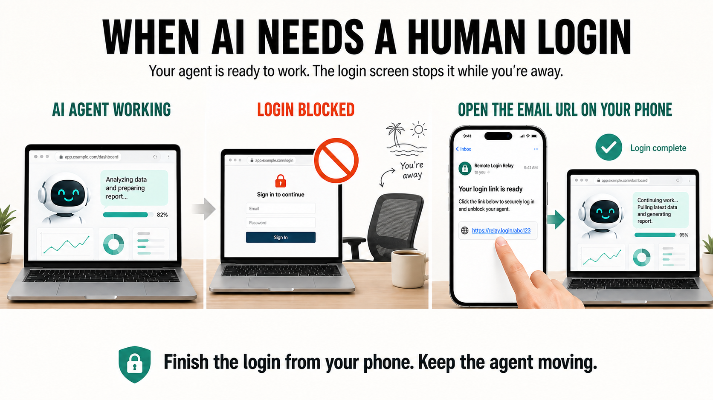

<div align="center">

# [ToolArks](https://toolarks.com) Remote Login Relay

**Let your AI agent continue — even when you are away from the Mac.**

Finish one human-only Chrome login from your phone, without handing passwords or the whole desktop to an AI agent.

[](self-hosted/LICENSE)
[](#requirements)
[](#requirements)
[](#install-and-prepare-chrome)
[](#choose-a-public-path)
[](#configure-email)
[](https://github.com/zdayang/remote-login-relay/stargazers)
[](https://github.com/zdayang/remote-login-relay/issues)

[Website](https://toolarks.com/en/remote-login-relay) · [Installation](self-hosted/README.md) · [Security](SECURITY.md) · [Report an issue](https://github.com/zdayang/remote-login-relay/issues/new)

[English](README.md) | [简体中文](self-hosted/README.zh-CN.md)

</div>



## Why this exists

Codex, Claude Code, and browser agents can complete most of a workflow locally. The final human-only step can still stop everything: a QR code, one-time code, passkey, CAPTCHA, phone prompt, or consent screen appears while you are away from the Mac.

The usual choices are to wait, share sensitive credentials with the agent, or expose the entire desktop through a general remote-access tool. Remote Login Relay provides a narrower handoff:

> **One exact Chrome tab · one owner · one short-lived session.**

## What it does

1. The Skill matches one open Chrome tab by a specific URL or title fragment and refuses zero or ambiguous matches.
2. A local gateway connects to that tab through Chrome DevTools Protocol.
3. Before any link is delivered, the relay checks that the target tab is still usable and is not already showing an expired or timed-out login page.
4. A short-lived random token is placed in a phone link. The same private link is shown in the current AI conversation and sent by email, so you can use it immediately or notice it while away from the chat.
5. The phone receives images of that tab and sends bounded pointer, keyboard, scroll, back, and reload actions.
6. After you finish the login, the agent confirms that the original page left the login screen and the relay is stopped.

Passwords, verification codes, cookies, browser storage, and session tokens are not exported to the AI workflow.

## What is included

- Codex and Claude Code Skill;
- one-tab Chrome controller and local gateway;
- mobile browser interface;
- guided SMTP setup for Gmail, Microsoft 365, and custom providers;
- stable domain + named Cloudflare Tunnel route;
- temporary Cloudflare Quick Tunnel route when you do not have a domain;
- dual link delivery: direct in the active AI conversation plus ToolArks-branded email notification;
- English and Simplified Chinese documentation;
- contract, email, and isolated-Chrome end-to-end tests.

## Choose a public path

| Path | Best for | Address | Trade-off |
| --- | --- | --- | --- |
| **Named Cloudflare Tunnel** | Repeatable personal use | Your own domain | Requires a domain and one-time Cloudflare setup |
| **Cloudflare Quick Tunnel** | A quick trial | Temporary `trycloudflare.com` URL | The address changes on every run |

Both paths keep the gateway on your Mac and expose only the selected Chrome tab. The guided wizard asks which path fits before it asks for email settings.

## Prefer a managed setup?

Self-hosting is the open-source route when you want to keep the gateway, domain, tunnel, and email configuration under your control. If you want to start without configuring those pieces, use **[ToolArks Remote Login Relay Cloud](https://toolarks.com/en/remote-login-relay)**:

| | Self-hosted | ToolArks Cloud |
| --- | --- | --- |
| Domain and tunnel | You configure them | Operated by ToolArks |
| Email delivery | Your SMTP mailbox | Included in the service |
| Browser relay | Runs on your Mac | Runs through the ToolArks service |
| Setup | Install and configure | Open the product page and start |

Cloud is a separately operated service; its implementation is not included in this repository. See the [ToolArks Remote Login Relay product page](https://toolarks.com/en/remote-login-relay) for the current service details and support options.

## Quick start

```bash
git clone https://github.com/zdayang/remote-login-relay.git
cd remote-login-relay/self-hosted
npm install
./scripts/setup.sh
./scripts/test-email.sh
./scripts/install.sh codex       # or: ./scripts/install.sh claude
```

The [self-hosted setup guide](self-hosted/README.md) explains the domain, Cloudflare, SMTP, Chrome, and first-handoff steps in detail.

### Tell us whether the first handoff worked

The self-hosted edition has no hidden product telemetry. If you try it, two short voluntary reports help us improve the setup without collecting browser activity:

- [My first phone handoff worked](https://github.com/zdayang/remote-login-relay/issues/new?template=handoff-success.yml)
- [I was blocked during setup or handoff](https://github.com/zdayang/remote-login-relay/issues/new?template=setup-blocked.yml)

Do not include passwords, verification codes, cookies, temporary relay URLs, screenshots of private pages, or other credentials in an issue.

### Requirements

- macOS 13 or newer;
- Node.js 20 or newer;
- Google Chrome or Chromium;
- `cloudflared` (`brew install cloudflared`);
- an SMTP mailbox allowed to send to your notification address;
- Codex or Claude Code if you want to use the packaged Skill.

### Install and prepare Chrome

Chrome 136 and newer require a non-default profile when remote debugging is enabled. Use a separate profile for agent-controlled work:

```bash
open -na "Google Chrome" --args \
  --remote-debugging-port=9222 \
  --user-data-dir="$HOME/Library/Application Support/ToolArks/RemoteLoginRelayChrome"
```

Keep port `9222` on localhost. Sign in to the websites you need inside this Chrome profile, then confirm the endpoint:

```bash
curl --noproxy '*' http://127.0.0.1:9222/json/version
```

### Configure email

Run the setup wizard and choose Gmail/Google Workspace, Outlook/Microsoft 365, or another SMTP provider. The wizard stores an authenticated mailbox password in macOS Keychain; it is never written to `config.env`, printed, or sent to ToolArks.

Before a real handoff, run:

```bash
./scripts/test-email.sh
```

### Start a handoff

Open the login page in the isolated Chrome profile and identify exactly one tab:

```bash
./scripts/start.sh 30 'accounts.example.com/login'
```

The command refuses zero or ambiguous matches, rejects an explicitly expired or timed-out login page, starts the local gateway, verifies the public endpoint, and delivers the same complete temporary link in two ways: directly in the active AI conversation and by email to your configured notification address. Use the direct link immediately, or open the ToolArks email on your phone when you are away from the chat.

When finished:

```bash
./scripts/stop.sh
./scripts/status.sh
```

## Using the Skill

Ask your agent to use `$remote-login-relay` when it reaches a human-only login step. The Skill guides first-run setup, tests email delivery, selects one exact blocked tab, returns the private phone link in the current conversation, sends a ToolArks-branded email notification, and verifies the original tab after login.

The Skill never reads or requests browser passwords, cookies, verification codes, or session tokens.

## Security boundary

- Exactly one explicitly matched Chrome tab is shared, never the whole desktop.
- The Chrome debugging port stays on localhost and must never be published directly.
- The complete temporary URL is a bearer credential. Anyone who receives it can control the selected tab until it expires or the session is stopped.
- Direct delivery means the local terminal and active AI conversation provider process the complete URL and may retain it under their own history or logging policies. Keep sessions short and stop them immediately after login.
- Quick Tunnel addresses are temporary and change between runs. A stable address requires your own domain and named Cloudflare Tunnel.
- The self-hosted package stores SMTP passwords in macOS Keychain when configured with an authenticated mailbox; secrets are not written to `config.env`.
- No macOS account password is requested during installation or use.
- Windows, Safari, whole-machine control, sleeping Macs, multi-user sharing, and permanent unattended access are not supported in the current release.

Read [SECURITY.md](SECURITY.md) before exposing a self-hosted hostname.

## Verification status

The current public source has automated coverage for:

- contract and fail-closed tab-selection checks;
- ToolArks-branded email delivery and HTTPS-link validation;
- isolated Chrome gateway frame delivery and remote text input;
- setup wizard routes and shell syntax;
- dependency audit with zero high-severity vulnerabilities at the tested commit.

Real customer demand and repeat use are not yet validated. Treat this as an early open-source product, not as an authentication service or security bypass.

## Repository layout

```text
remote-login-relay/
├── assets/           Product workflow illustration
├── core/             Shared one-tab Chrome controller
├── self-hosted/      MIT-licensed Skill, gateway, mobile UI, and setup scripts
└── SECURITY.md       Threat model and deployment boundaries
```

## License

The self-hosted edition is licensed under the [MIT License](self-hosted/LICENSE).

Built by [ToolArks](https://toolarks.com) · [Remote Login Relay](https://toolarks.com/en/remote-login-relay)
